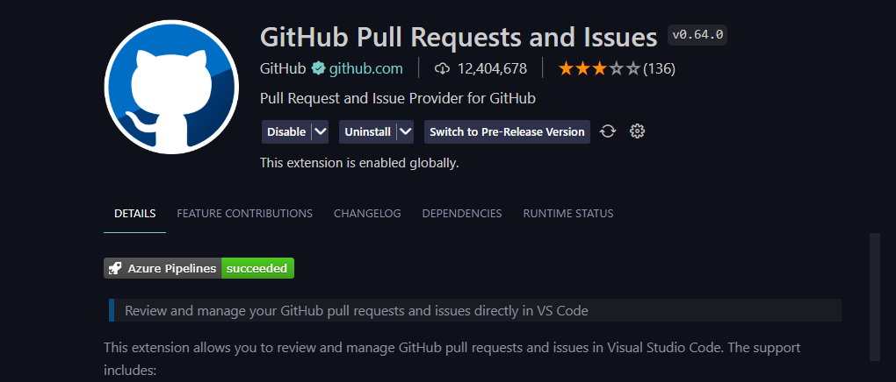
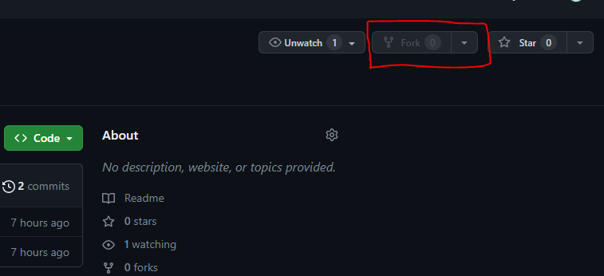
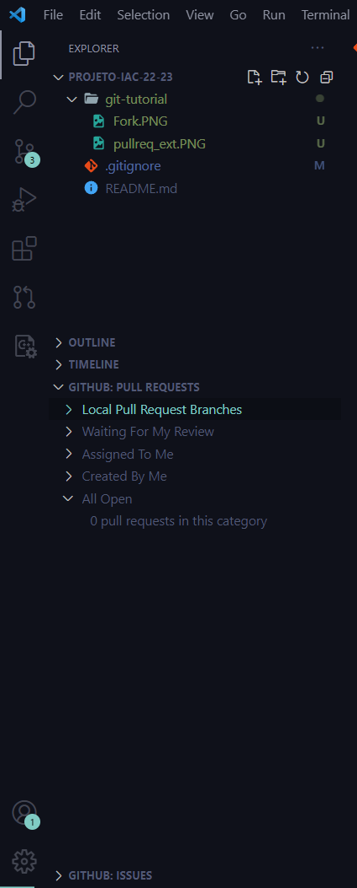
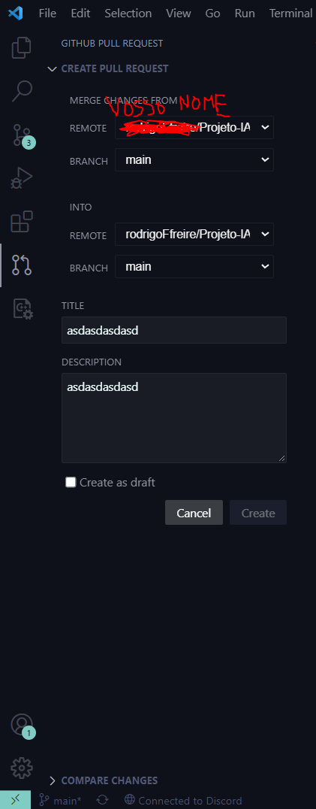

# Projeto IAC 22/23

# Indice
1. [CheckList Versao intermedia](#CheckList-Versao-Intermedia)
2. [TODO](#TODO) 
3. [Tutorial Git](#Tutorial-Git)

## CheckList Versao Intermedia
- [ ] Teclado completamente functional (Rodas)
- [ ] Painel de instrumentos
- [X] Cenario de fundo
- [ ] Asteroide no topo esquerdo que desce na diagonal....(ver pdf) {Tecla 5}
- [ ] Efeito sonoro quando o asteroide desce
- [ ] Sonda na direção do meio a subir...(ver pdf) {Tecla 1}
- [ ] Teclas para incrementar ou decrementar o valor dos displays {Tecla 6(+), Tecla 4(-)}

  

## TODO (Lista de coisas para fazer)
- [X] Cenarios de Fundo:    (Rodas)
  - [X] Main menu
  - [X] Video de fundo durante o jogo
  - [X] Texto de Pausa
  - [X] Jogo Terminado
  - [X] Nave Explodiu
  - [X] Nave sem Energia
  
- [X] Sound Effects:    (Rodas)
  - [X] Sonda Lançada
  - [X] Asteroide Destruido
  - [X] Energia Minerada
  - [X] Som de Pausa/Retomar
  - [X] Nave Destruida
  - [X] Jogo terminado

## Tutorial Git (Fork, Pull Requests, Merge...)
- No **VSCode** instalem a extensão **GitHub Pull Requests and Issues**  
- Fazer **Fork** deste projeto 
- 
- Fazer **clone** do repositorio forked. Não façam clone do repositorio original
- Quando tiverem feito clone é fazer como antigamente:
  - Dar **pull** para dar refresh, dar **commit** e **push** etc... (como foi no gitlab)
- Quando tiverem dado **push** e quiserem submeter partes do projeto já prontas têm que fazer um **Pull Request**
  - Vão onde diz **Github: Pull Requests**. Aquilo vai aparecer um botao com um simbolo para adicionar cliquem nisso 
  - E verifiquem se esta tudo certo como na imagem, ponham um titulo e descricao a dizer o que é que fizeram e tal etc.... 
